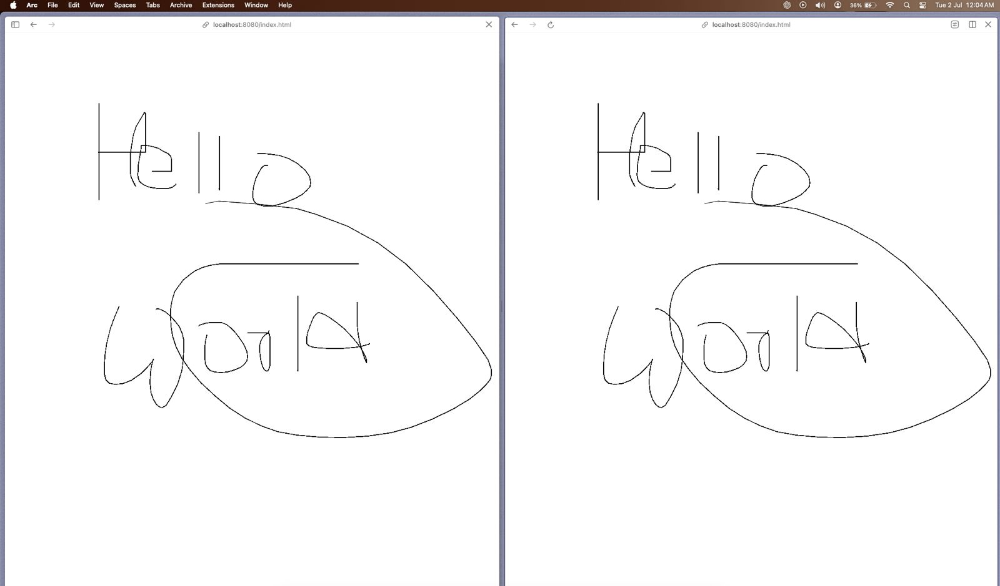

# Simple Realtime Whiteboard Application

This is a simple realtime whiteboard application built using Node.js, Express.js, Socket.io and HTML5 Canvas.



## Features
- Realtime drawing on a shared whiteboard

## Installation
1. Clone the repository
2. Install the dependencies
```bash
npm install
```
3. Start the server
```bash
npm start
```
4. Open the application in your browser
```
http://localhost:8080/index.html
```